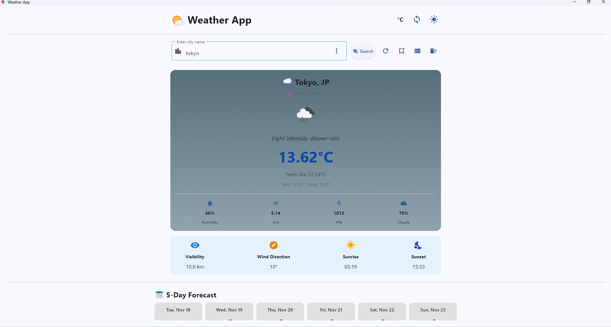
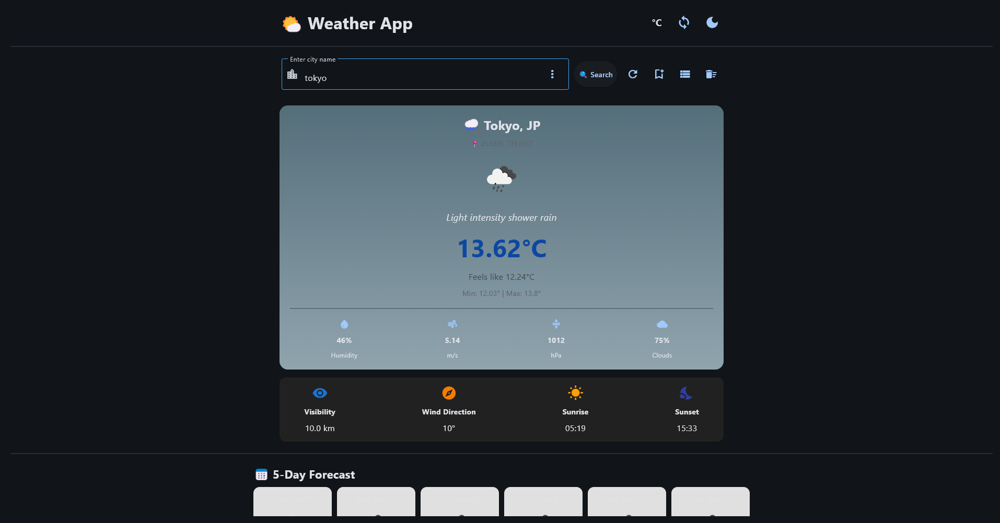
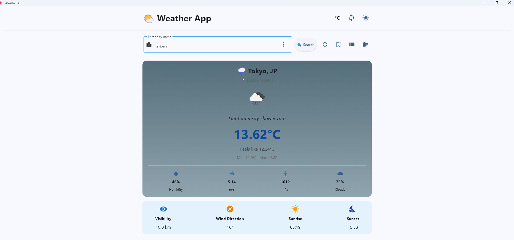
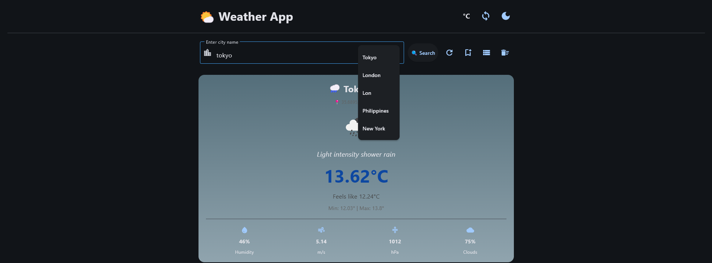

# Weather Application - Module 6 Lab

## Student Information
- **Name**: Jeric Romance
- **Student ID**: 231002222
- **Course**: CCCS 106
- **Section**: 3B

## Project Overview
The Weather Application is a modern Python-based weather dashboard built using the Flet framework.
It provides real-time weather updates, 5-day forecasts, multi-city comparisons, and dynamic visual alerts — all within a clean, responsive, and theme-adaptive user interface.

The app uses the OpenWeatherMap API to fetch accurate weather data and displays it in a visually organized layout, combining both functionality and design aesthetics.
The app integrates with the OpenWeatherMap API to fetch accurate, up-to-date weather information.
## Features Implemented

### Base Features
- [/] City search functionality
- [/] Current weather display
- [/] Temperature, humidity, wind speed
- [/] Weather icons
- [/] Error handling
- [/] Modern UI with Material Design

### Enhanced Features
1. **Dark/Light Mode Toggle**

- Description: Seamlessly switch between light and dark themes with a single icon toggle.

- Why: Improves readability and user comfort across environments.

- Challenge: Maintaining visibility and contrast in dark mode — solved by dynamically adjusting text and background colors.

2. **Celsius ↔ Fahrenheit Toggle**

- Description: Allows users to toggle temperature units directly from the main UI, displayed as a simple “C / F” icon switch.

- Why: Provides flexibility for global users.

- Challenge: Keeping both display and API consistent when toggling units.

3. **5-Day Forecast**

- Description: Displays a visual 5-day forecast below the main weather results using styled cards and weather icons.

- Why: Helps users plan ahead with a clear overview of upcoming weather.

- Challenge: Parsing and grouping API data by day — handled using filtering by dt_txt timestamps.

4. **Weather Alerts**

- Description: Displays snackbars for extreme weather conditions (high heat, storms, cold rain, etc.).

- Why: Keeps users informed of important weather changes in real time.

- Challenge: Ensuring alerts don’t overlap with other messages — solved with a unified snackbar handler.

5. **Watchlist & Multi-City Comparison**

- Description: Users can add cities to a watchlist and view multiple weather reports side-by-side.

- Why: Enables quick comparison for travelers or regional monitoring.

- Challenge: Handling asynchronous data fetching — solved using asyncio.gather() for parallel API calls.

6. **Persistent Search History**

- Description: Search history appears dynamically when clicking the search bar, allowing quick access to recent cities.

- Why: Improves usability and saves time for returning users.

7. **Unified Alert System (Snackbars)**

- Description: Displays a Snackbar-based alert system for extreme weather conditions (e.g., heat, storms, cold rain).

- Why: Keeps users instantly informed of critical conditions in a non-intrusive way.

- Challenge: Preventing overlapping messages and keeping a consistent alert style. Solved by implementing a unified snackbar handler that manages all message types — including error, warning, success, info, and weather alerts.
## Screenshots
**Light and dark mode**
- 
- 

**5-Day_Forecast**
- 

**Test Script**
- 


**History List**
- 

## Installation

### Prerequisites
- Python 3.8 or higher
- pip package manager
- OpenWeatherMap API key

### Setup Instructions
```bash
# Clone the repository
git clone https://github.com/titojek/cccs106-projects.git
cd cccs106-projects/mod6_labs

# Create virtual environment
python -m venv venv
source venv/bin/activate  # On Windows: venv\Scripts\activate

# Install dependencies
pip install -r requirements.txt

# Create .env file
cp .env.example .env
# Add your OpenWeatherMap API key to .env
